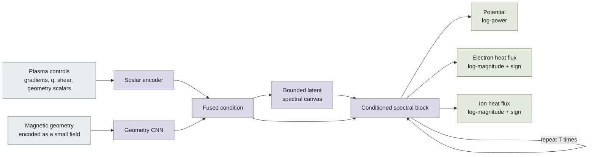
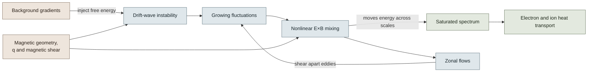

# TatyanaV4

> Can a neural network learn the *shape* of turbulent transport, not just return one number?

That is the question behind TatyanaV4.

The bad news: nonlinear gyrokinetic simulations are expensive. The good news: once a surrogate has learned the map, asking it for another prediction is much cheaper than politely requesting another supercomputer campaign.

TatyanaV4 takes plasma parameters and magnetic geometry as inputs, then predicts two-dimensional spectra of electrostatic-potential power and electron/ion heat flux. This repository is the **data-free public version**: you can inspect the model, losses, and tests, but no research database or database-derived artifact is included.

## The 60-second version

| Question | Short answer |
| --- | --- |
| What goes in? | Normalized plasma controls and an encoded magnetic-geometry field |
| What comes out? | Potential-power and signed electron/ion heat-flux spectra over a \((k_x,k_y)\) grid |
| Why spectra? | One integrated flux number hides where transport sits in scale space |
| What is learned? | A geometry-conditioned nonlinear map to the saturated spectral state |
| Is it a gyrokinetic solver? | No. It is a surrogate, not GENE wearing a neural-network hat |
| Where are the data and weights? | Intentionally absent; see [DATA_POLICY.md](DATA_POLICY.md) |

## What the model does



The latent block works in Fourier space because the target itself is spectral and because turbulence couples scales. The repeated update is best read as **learned relaxation** toward a prediction. It is not a time step of the gyrokinetic equation.

## The physics idea, without the thicket of notation



A familiar first estimate is the mixing-length rule

\[
D_{\mathrm{ML}} \sim \frac{\gamma}{k_\perp^2}.
\]

It captures a useful idea: saturation begins when nonlinear decorrelation can compete with linear growth. But it is a compass, not a universal closure. Eigenfunctions, competing modes, zonal-flow response, collisions, geometry, and spectral conventions all matter. A large linear growth rate does not come with a receipt telling us the final nonlinear heat flux.

For that reason, TatyanaV4 does not bolt one fixed saturation amplitude onto a linear prediction. It learns the full spectral map while keeping a few guardrails:

| Guardrail | Why it is there |
| --- | --- |
| Predict the spectrum directly | Preserves scale location and spectral shape |
| Split heat flux into magnitude and sign | Keeps reversals representable without taking the log of a negative number—always a bad afternoon |
| Include integrated-flux consistency in the loss | Connects local spectral accuracy to the transport quantity people actually use |
| Fit normalization on the training split only | Prevents information leakage from making validation look suspiciously wonderful |
| Make \(k_x\) reflection optional | Symmetry is used only when the Fourier and averaging convention supports it |

## Why this is V4

Earlier experiments were useful, but they also exposed a few architectural traps. V4 fixes them explicitly.

| Earlier issue | V4 change | Practical meaning |
| --- | --- | --- |
| Fourier contraction did not genuinely mix channels | Contract input and output channels explicitly | Spectral features can interact instead of travelling in parallel lanes |
| One kernel covered only one side of the first FFT axis | Separate complex kernels for positive and negative low modes | Both sides of the represented spectrum are learned |
| Cross-attention used one key/value token | Replace it with FiLM conditioning and a learned gate | Conditioning can actually vary the latent update; a one-element softmax is always 1, however confidently we name it “attention” |
| Amplitude arithmetic could leave log space too early | Compose in log space and bound reconstruction | Better numerical behaviour over a wide dynamic range |
| All observables shared one final decoder | Separate potential, electron, and ion branches | Reduces unwanted competition between physically different targets |

These are structural improvements and are covered by data-free tests. I do **not** claim an accuracy gain until the model has been retrained and compared under the same private split and optimization budget.

## Who did what—and where the data came from

The private simulation databases used during development were supplied through the **NTU Plasma Theory group** and by **Youngwoo Cho at the Korea Institute of Fusion Energy (KFE)**.

I, **Tingyi Chen**, developed the surrogate model: architecture, implementation, leakage-aware evaluation design, and numerical diagnostics. I did **not** create or own the databases.

This public repository includes:

- model and loss-function code;
- synthetic shape/gradient tests;
- a random-tensor smoke example; and
- the publication boundary in [DATA_POLICY.md](DATA_POLICY.md).

It does not include:

- simulation databases or samples;
- private preprocessing details or fitted normalization statistics;
- checkpoints, trained weights, optimizer state, or logs; or
- database-derived metrics, reports, or figures.

So, no, the random tensors in the example are not tiny secret plasmas. They are just random tensors.

## Quick start

```bash
python -m venv .venv
source .venv/bin/activate
python -m pip install -e .
python -m unittest discover -s tests -v
python examples/synthetic_smoke.py
```

Minimal API use:

```python
import torch
from tatyana_v4 import ModelConfig, TatyanaV4, reconstruct_physical_outputs

config = ModelConfig()
model = TatyanaV4(config)

scalars = torch.randn(2, config.n_scalars)
geometry = torch.randn(2, config.geometry_channels, 16, 16)
log_outputs, thought_states = model(scalars, geometry)
physical_outputs = reconstruct_physical_outputs(log_outputs)
```

## How I would decide whether it actually works

A single flattering score is not enough. In particular, high rank correlation with the wrong amplitude means the model has learned ordering, not reliable transport.

| Check | What it catches |
| --- | --- |
| Error in log and physical space | Shape errors versus amplitude errors |
| Per-case \(R^2\) and rank correlation | Calibration versus ordering |
| Integrated electron/ion heat-flux error | Whether the spectrum adds up correctly |
| Cuts across \(k_x\) and \(k_y\) | Shifted peaks, missing tails, and over-smoothing |
| Grouped train/validation/test splits | Leakage between closely related simulation cases |
| Multiple seeds and fixed-budget ablations | Improvements that disappear when the comparison becomes fair |

## Current status

This is research software under active development. The public code is ready for architecture review and data-free testing, but it is **not** a released predictive model. Reproducing empirical results requires authorized access to compatible data and a fresh training-only normalization fit.
